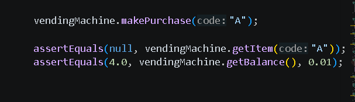

Bug 1: 

	public VendingMachine() {
		itemArray = new VendingMachineItem[NUM_SLOTS];
		for (int i = 0; i <= NUM_SLOTS; i++) {
			itemArray[i] = null;
		}
		this.balance = INITIAL_BALANCE;
	}

i <= NUM_SLOTS is the identified bug, it goes out of bounds. The fault is that NUM_SLOTS onlt has 4 indexes but this code loops through 5 times to index 4(the 5th index) so i simply removed the equals sign. to observe it, I tried to do addItem and it said index out of bounds and thats how i saw it.

BUG 2:

	public void insertMoney(double amount) throws VendingMachineException {
		if (amount < 1)
			throw new VendingMachineException(VendingMachine.INVALID_AMOUNT_MESSAGE);
		this.balance += amount;
	}

if (amount < 1) IS THE ERROR. the vending machine should be able to accept down till 0, however this decliens anything less than a $1, this was found with my insertMoney test. The fault is amount < 1 the failure is the throwing of an exception when the amount entered is actually valid

ADDED BUG:

	public boolean makePurchase(String code) {
		boolean returnCode = false;
		VendingMachineItem item = getItem(code);
		if ((item != null) && (this.balance >= item.getPrice())) {
			removeItem(code);
		// INJECTED FAULT FOR TEST VALIDATION
			this.balance += item.getPrice();
			returnCode = true;
		}
		return returnCode;
	}

this.balance += item.getPrice(); the fault is that balance should not be added with the price its supposed to be subtracted so the fault is that subtraction, and the failure is the wrong balance being returned. The test was able to detect the fault because the test identifies if the balance was accuretely updated.

